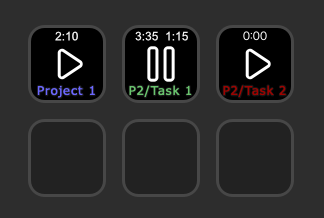

# Time tracker plugin for Elgato Stream Deck (v0.7.0)

Time tracker using the open source platform [Kimai](https://www.kimai.org/).

Kimai can be [self-hosted](https://www.kimai.org/documentation/chapter-on-premise.html) or used as a service, that also offers a [free plan](https://www.kimai.cloud/start-trial).

## How it works

Adds a button for tracking time on projects or tasks. Displays the time that has been tracked today and on the current time period.

### Prerequisites

You need to have at lease one project and one activity set up in Kimai.

In the plugin you provide your credentials and select the project and activity on which time should be tracked.

## Installation

Download the [latest realase](https://github.com/b263/stream-deck-time-tracker/releases/latest/download/dev.b263.time-tracker.streamDeckPlugin).

Double-click the downloaded file to add it to Stream Deck.
